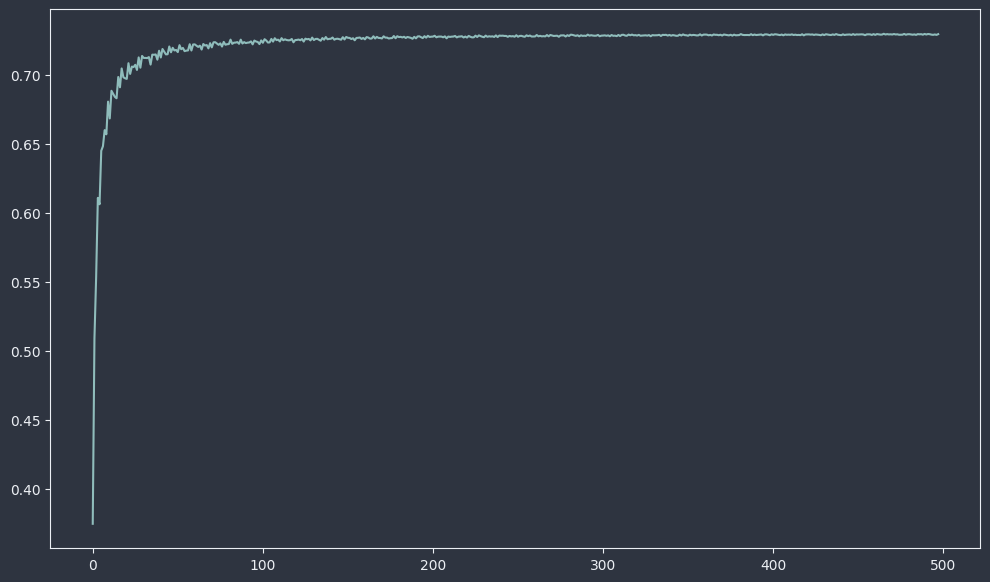
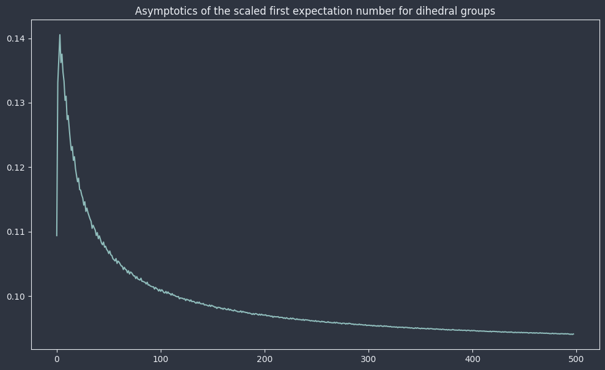
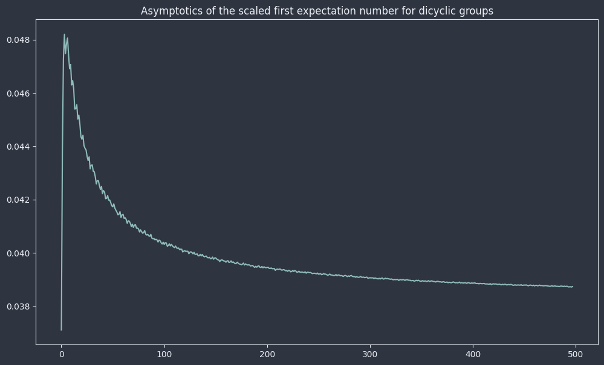

# Expectation Numbers of Groups - Asymptotics

```python
import noetherpy as ntr
```

If $G$ is a finite group, then the *first expectation number of* $G$ is the expected value of the size of the subgroup generated by an element chosen uniformly randomly. Concretely, this is the value:
$$E_1(G) = \frac{1}{|G|}\sum_{g\in G}|\langle g \rangle|$$

In `noetherpy`, for an instance `G` of the `Group` class, the above value is readily computed via:

```python
ntr.expectation_number(1,G)
```

Generalizations of this are available in the library. For example, the $k$-th expectation number of $G$ is defined as:
$$E_k(G) = \frac{1}{\binom{{|G|}}{k}}\sum_{\{i_1,...,i_k\}\subseteq \{1,...,n\}}|\langle g_{i_1},...,g_{i_k}\rangle|$$

which is available as `ntr.expectation_number(k,G)`. Additionally, we may also want to compute the expected proportion of $G$ which wil be generated by randomly chosen elements (e.g., for the first expectation number this is $E_1(G)/|G|$). This can be toggled via the `scale_by_order` parameter of `ntr.expectation_number`, which is set to `False` by default. 

These scaled expectation numbers have interesting asymptotic properties. For example, letting $C_n$ denote the cyclic group of order $n$, we have:
$$\sum_{k = 1}^{\infty}\frac{E_1(C_k)}{k} = \frac{\zeta(3)}{\zeta(2)}\approx 0.7307,$$
where $\zeta$ is the Riemann-Zeta function. This result is saying that if we randomly uniformly select am element from a cyclic group, then we can expect it to generate about 73% of the group. We can easily verify this numerically with `noetherpy`:

```python
import noetherpy as ntr
import pandas as pd
import seaborn as sns

N = 500
sum_asym = 0
vals = []
for i in range(2,N):
    C_k = ntr.cyclic_group(i)
    exp_1_C_k = ntr.expectation_number(
        k=1,
        group=C_k,
        scale_by_order=True,
    )
    sum_asym += exp_1_C_k
    vals.append(sum_asym/i)

ser = pd.Series(vals)

sns.lineplot(data=ser)
plt.show()
```


Although the exact value of the sum above is known for cyclic groups, it is (to my knowledge) not known for other infinite families of groups, like dihedral groups, symmetric groups, etc. These values can be approximated with `noetherpy`:

```python
N = 500
sum_asym = 0
vals = []
for i in range(2,N):
    G = ntr.dihedral_group(i)
    exp_1_G = ntr.expectation_number(
        k=1,
        group=G,
        scale_by_order=True,
    )
    sum_asym += exp_1_G
    vals.append(sum_asym/G.order)

ser = pd.Series(vals)

sns.lineplot(data=ser)
plt.show()
```


For dihedral groups, we appear to have:
$$\sum_{n = 1}^{\infty}\frac{E_1(D_n)}{2n} \approx 0.0941.$$

```python
N = 500
sum_asym = 0
vals = []
for i in range(2,N):
    G = ntr.dicyclic_group(i)
    exp_1_G = ntr.expectation_number(
        k=1,
        group=G,
        scale_by_order=True,
    )
    sum_asym += exp_1_G
    vals.append(sum_asym/G.order)

ser = pd.Series(vals)

sns.lineplot(data=ser)
plt.show()
```


For dicyclic groups, we appear to have:
$$\sum_{n = 1}^{\infty}\frac{E_1(\mathrm{Dic}_n)}{4n} \approx 0.0387.$$

Asymptotics like this can be explored for other groups, and other statistical invariants of groups.